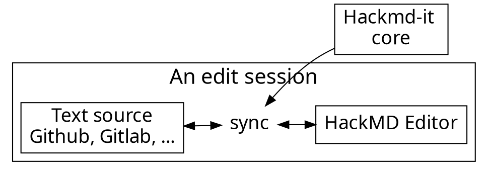

# Hill ⛰️
> **A place for better trading!** 


[<div style="text-align: right">pic source</div>](https://www.english-heritage.org.uk/visit/places/silbury-hill/)</p>

---

## Who We Are?

- We are fresh to business, but we passion for it. :heart: 
- A website focus on second-hand consumer electronic.
- Provide free-to-use website that everyone can sell and buy.

___ 

## Philosophy

Our vision is to extend the life cycle of used electronics. We hope to provide a trading platform for electronic products, for those who don’t need them, and those who want but don’t have enough money to buy a new ones.

> **Feature
>- "price trends" to understand the market price of its electronics :chart_with_upwards_trend: 
>- "tag" to find product easiler
>- "sorce" to know about trader information
>- 


___

### 70% of our users are developers. Developers :heart: GitHub.

---



---

### Usage flow

---




---

### Architecture of extension

---


---

## Content script

- Bind with each page
- Manipulate DOM
- Add event listeners
- Isolated JavaScript environment
  - It doesn't break things

---

# :fork_and_knife: 

---

<style>
code.blue {
  color: #337AB7 !important;
}
code.orange {
  color: #F7A004 !important;
}
</style>

- <code class="orange">onMessage('event')</code>: Register event listener
- <code class="blue">sendMessage('event')</code>: Trigger event

---

# :bulb: 

---

- Dead simple API
- Only cares about application logic

---

```typescript
import * as Channeru from 'channeru'

// setup channel in different page environment, once
const channel = Channeru.create()
```

---

```typescript
// in background script
const fakeLogin = async () => true

channel.answer('isLogin', async () => {
  return await fakeLogin()
})
```

<br>

```typescript
// in inject script
const isLogin = await channel.callBackground('isLogin')
console.log(isLogin) //-> true
```

---

# :100: :muscle: :tada:

---

### Wrap up

- Cross envornment commnication
- A small library to solve messaging pain
- TypeScript Rocks :tada: 

---

### Thank you! :sheep: 

You can find me on

- GitHub
- Twitter
- or email me
