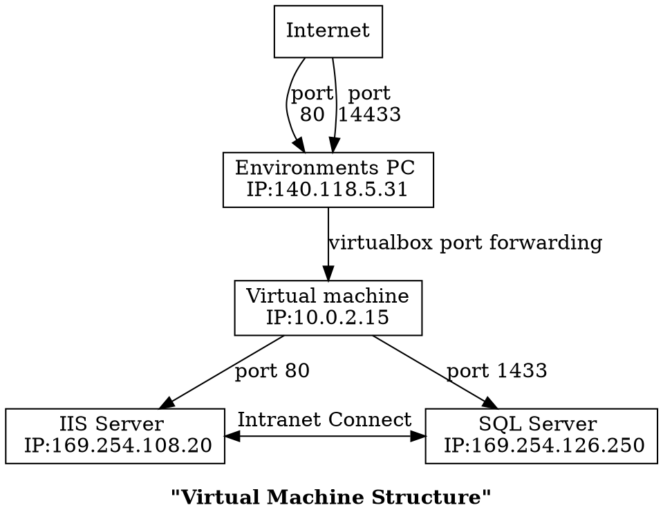
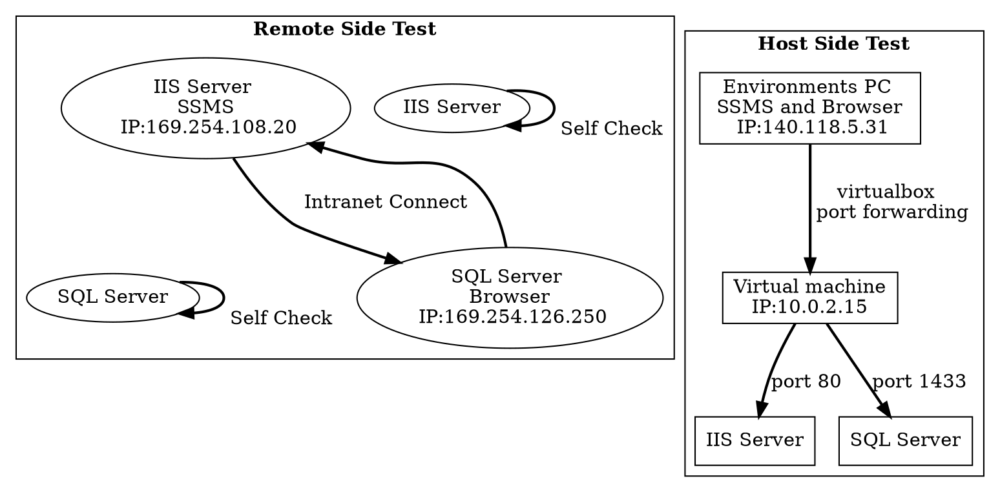

Using Virtual Machine to host web and SQL
===

| Team 10 | ID |     Name     |
| ------- | -- | ------------ |
||M10705336|吳佳欣             |
||M10805822|David Pratama Lays|
||M10805506|謝政廷             |

Index:
[TOC]

---

To host our 3-tier application, we will test it on virtual machine to make sure that every part is working great.


## Setup
### Environment
> [color=lightgreen]
> - CPU: Intel Core i5-3550
> - RAM: DDR3 16 GB
> - OS: Windows 10 workstation pro 1903(18362.418)
> - Static IP from NTUST
> - Virtual Machine: Oracle VirtualBox 6.0.14([Download](https://www.virtualbox.org/wiki/Downloads))

### Virtual Environment
> [color=lightgreen]
> - OS: Windows Server 2019([Download](https://www.microsoft.com/en-us/evalcenter/evaluate-windows-server-2019?filetype=ISO))
>
> - Software:
>  > [color=orange]
>  > - Microsoft SQL Server([Download](https://docs.microsoft.com/zh-tw/sql/ssms/download-sql-server-management-studio-ssms?view=sql-server-ver15))
>  > - SQL Server Management Studio([Download](https://docs.microsoft.com/zh-tw/sql/ssms/download-sql-server-management-studio-ssms?view=sql-server-ver15))
>  > - (optional) VBoxGuestAdditions([About](https://www.virtualbox.org/manual/ch04.html))

## Steps
### 1. Enable VT
For our Intel Processor, we have VT-x (for newer processor is VT-d) to virtualize. It should be turn on if you are virtualize 64-bits OS. ([Intel VT](https://www.intel.com.tw/content/www/tw/zh/virtualization/virtualization-technology/intel-virtualization-technology.html))
For other AMD's, it called AMD-v. ([AMD-v](https://www.amd.com/zh-hant/technologies/virtualization))
### 2. Install VirtualBox
In [Environment](#Environment), download VirtualBox and install, no extra setting is needed.
### 3. Install Windows Server in VirtualBox
1. Open VirutalBox and select ==**New**==(加入)

2. ==**Named**== this Virtual Machine. VirtualBox will auto adjust type(類型) and version(版本).
 
3. Pictures below shows virtual machine hardware's setting, adjust it according to your own preference!
Here we select the amount of memory (RAM) that will be alocated to our virtual machine. Here we choose 2048 MB for our RAM.

After that, we choose to create a virtual hard disk since we have not create it before.


After that, we decided to use dynamic disk so that the size of file will auto adjust by how much data that the virtual machine use. 


4. By clicking create(建立), our first virtual machine's environment is created.
Now going to install Windows Server.

5. Click ==**Start**== to boot the virtual machine.

6. Here VirtualBox is asking for ISO file to install [Windows Server](#Virtual-Environment). Click the ==**folder icon**==, and select the ISO file that we downloaded, then boot it.


7. The virtual machine is booting and come to setting screen.


8. Choosing ==**Desktop Experience**== because it makes easier to set things up and it is more user friendly.

9. Use ==**Custom**== option instead of Upgrade option to install because this is our first time installing Windows Server 2019 in our virtual machine.

10. Select the drive where we want to install the Windows Server 2019 then directly press the next button (Because we set this virtual machine's storage as dynamic disk, so don't partition this disk or it will not auto expand storage).

11. After that, the instalation process is running.

12. After finishing installation process, the system will auto reboot and load for first time setting. Here you need to setup a password for Administrator. The password should follow [==Windows Security Policy==](https://docs.microsoft.com/zh-tw/windows/security/threat-protection/security-policy-settings/password-must-meet-complexity-requirements)

13. The OS is already installed. We can just log in and start using the OS. 


### 4. Clone VDI
1. After we finished [Installing Windows Server](#3-Install-Windows-Server-in-VirtualBox), ==**shutdown**== the virtual machine and ==**clone**== this virtual machine, so that we can use it to simulate 3-tier application. Below are the pictures on how we ==**clone**== the virtual machine.


### 5. Enable IIS
1. ==**Start**== the Windows Server for IIS and go into ==**Server Manager**==.


2. Click ==**Add roles and features**==.

3. Simply click next step.


4. In Server Roles,click check box of ==**Web Server (IIS)**==, then ==**Add Feature**== for web server. 


5. Check box .NET Framework 3.5 for compatibility since there are some old functions for IIS that only work in .NET 3.5.

6. Check CGI for using php (optional).

7. Confirm all settings, and go to installation process.


8. After we finished the installation process, you will see IIS display in Server Manager. 


### 6. Install MSSQL
After downloading the file of [MSSQL](#Virtual-Environment), we will install Microsoft SQL server in [the clone virtual machine](#4-Clone-VDI) for SQL.
1. Open the install exe file, then click ==**Basic**== for easily installation, then simply next step to finish the process. 


### 7. Install SSMS
After downloading the file of [SSMS](#Virtual-Environment), we install it both virtual machine and environment PC for checking SQL is working. 


After we finished installing, ==**restart**== the virtual machine and environment PC for finish all installation process. 
### 8. Port Forwarding
After finishing all the setup, now we setup port forwarding in VirtualBox to visit our IIS and SQL by internet.
#### For IIS
1. Select IIS Virtual Machine and click ==**Setting**==. 

2. Select Network and click ==**Advance**== to expand and click ==**Port forwarding**==.

3. Setup IP forwarding. Here we fill the IP address and the port number for both the Host (Environment) and the Guest (Virtual Machine). Ip address can be obtained by typing "ipconfig" in CMD in both host and Virtual Machine. Meanwhile, the port number is filled 80 since it is a default port number for web server.

#### For SQL
1. Select SQL Virtual Machine and click ==**Setting**==. 

2. Select Network and click ==**Advance**== to expand and click ==**Port forwarding**==.

3. Setup IP forwarding. Same as before, we fill the IP address and port number for both host computer and virtual machine. The only difference is the port number, where the default port number for database is 1433.

4. After that, start ==**SQL Virtual Machine**== and go to ==**Server Manager**==

5. Click ==**Tools**== and click ==**Windows Defender Firewall with Advanced Security**==

6. Select ==**Inbound Rules**== and click Action and click ==**New Rule...**==


7. Check ==**Port**==, next step check ==**Specific local port**== and insert ==**1433**==, next step to ==**Allow the connection**==, next step apply rule, at last, ==**named**== this rule.


### 9. Intranet setup
In order to be able accessing IIS from SQL and the other way around, we need to setup ==**Intranet**==. Below are the steps on how to do it:
1. Click ==Setting => Network => Adapter 2==, switch ==**Attached to**== to ==**Internal Network**==


2. Here we can see each IP address for IIS and SQL. 

| Server   |   Intranet IP     |  NAT IP     |
| :------: | :---------------: | :---------: |
|  IIS     | 169.254.108.20    | 10.0.2.15   |
|  SQL     | 169.254.126.250   | 10.0.2.15   |


## Check
Here, we will test our virtual environments by remote side and host side. 



### IIS
#### Remote
Just boot IIS Server and type ==**```http://localhost/```**== or ==**```http://127.0.0.1/```**==. It will display default image setting by Microsoft.

#### Host
Similar as remote side, but change address to ==**```http://140.118.5.31/```**==. 

#### Intranet
For testing IIS, we use SQL server side to test is intranet works or not. 


### SQL
#### Remote
Boot SQL server virtual machine, simply open SSMS, and click ==**Connect**== (or in ==File => connect Object Explorer==), it will show out what is in SQL server. 


Here we will add a new account for host side to login to this SQL server.
1. In the ==**connected**== Object Explorer, right click ==**Logins**== (in ==Databases => Security => Logins==), ==**New Login...**==.

2. Check ==**SQL Server authentication**==, and fill in ==**(1)Login name, (2)Password, (3)Confirm Password**==, then click OK. 
:::success
(Note) Password should follow [security policy](https://docs.microsoft.com/zh-tw/windows/security/threat-protection/security-policy-settings/password-must-meet-complexity-requirements)
:::

3. Right click SQL server and select ==**Properties**==. 

4. Select ==**Security**==, in Server authentication, check ==**SQL Server and Windows authentication mode**==, then disconnect to test this account.


:::success
After created a new account, ==restart SQL service== to enable the account. 


:::
5. Now we are trying to connect to our SQL in ==**SQL Server Authentication**== mode, leave Server name as default, or setup ==**TCP/IP**== in ==**Server Configuration Manager**==, so that we can change it to ==```localhost,1433```== or ==```127.0.0.1,1433```==, after connect success, it will display as before.


:::success
(Note) In SSMS, ip and port are split by ==**,**== not ==**:**==.
format: <ip>,<port>
:::


#### Host
After remote side test, keep SQL server alive, then open SSMS in ==**host side**==. 
1. In Server name, change it to ==```140.118.6.31,14433```== and fill in account and password. IF success, it will display as usual. 


#### Intranet
For testing SQL, we use IIS server to test intranet works or not.


# Reference
#### IIS
[1] https://www.mf8.biz/windows-server-2019-install-iis10/
[2] https://www.rootusers.com/how-to-install-iis-in-windows-server-2019/
[3] https://www.kjnotes.com/devtools/77
[4] https://myapollo.com.tw/zh-tw/virtualbox-port-forwarding/
#### SQL
[1] https://blog.alantsai.net/posts/2017/11/sql-troubleshooting-guide-mssql-connection-problem
#### Graphviz
[1] https://stackoverflow.com/questions/3462433/dot-graph-language-how-to-make-bidirectional-edges
[2] https://stackoverflow.com/questions/25734244/how-do-i-place-nodes-on-the-same-level-in-dot
[3] https://graphs.grevian.org/example
[4] https://www.tonyballantyne.com/graphs.html
[5] https://www.graphviz.org/pdf/dotguide.pdf